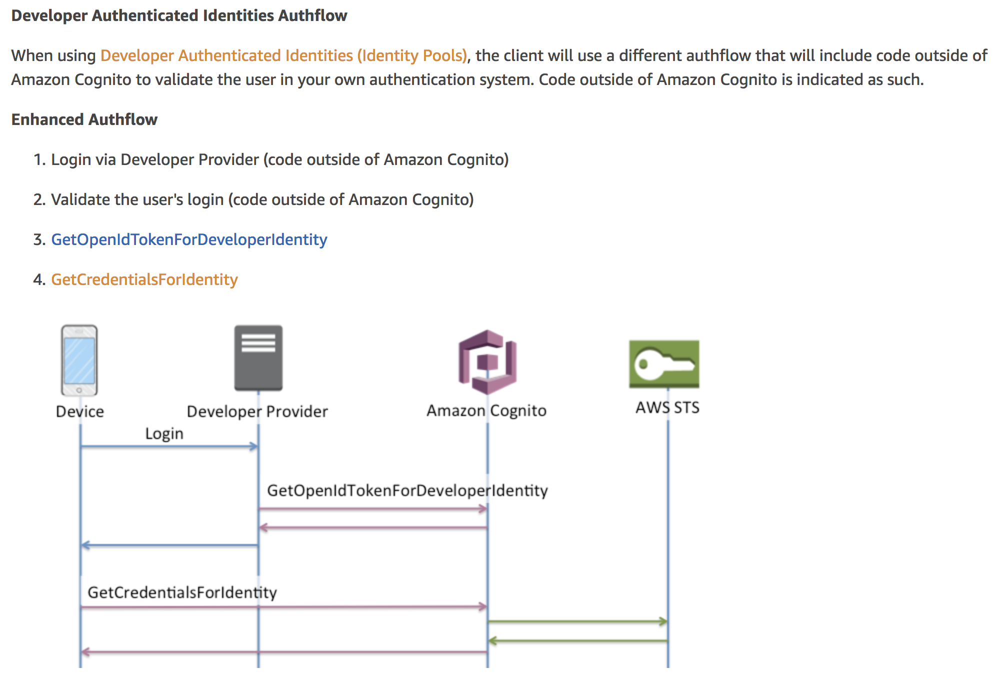

# Developer Authenticated Identities, AWS Cognito, AWS Lambda, and Xamarin.Forms
A small code experiment... Grown into a sample app (using [Prism](https://prismlibrary.github.io/)... which I love dearly)... on establishing a user in an AWS Identity Pool using Developer Authenticated Identities (custom SSO login) in order to access other AWS services (e.g., AWS Lambda functions) with authenticated users.

## Special thanks!
I'd like to profusely thank [kneekey23](https://github.com/kneekey23) and [steveataws](https://github.com/steveataws) for their help and advice as I struggled through learning how to implement this functionality. Thank you for your time, knowledge, effort, and assistance! I am in your debt!

## Purpose of this code
Users of this app login to a company's custom SSO server (a total fake in this app, but BOY is it fast!), and the app receives a unique id (the *GuidId* property you see in the code of the *coolAppSsoUser* object). 

The idea is that the user would log in with the custom SSO provider, and behind the scenes we are now trying to either create a new or get an existing Amazon Cognito Identity from an Identity Pool, using the data received from the SSO server (in particular, the user's unique id). 

We then move on to getting credentials for our Cognito user, and from there the user is able to trigger a Lambda functions.

## Concerns and To-Dos
* The constructor for the AwsCognitoService throws a System.InvalidOperationException, with a message of, "The app.config/web.config files for the application did not contain region information", even though I provide the region in the constructor.

## Where does this code come from?
Following the steps outlined in the [AWS documentation](https://docs.aws.amazon.com/cognito/latest/developerguide/authentication-flow.html), specifically under the heading **Developer Authenticated Identities Authflow**, then the sub-heading **Enhanced Authflow**. Please see the [Resources](https://github.com/jbachelor/DevAuthIdentitiesWithAwsCognitoInXamForms#resources) section below for more articles/videos that may be helpful in understanding this app and the problems it is trying to solve.

***

***

## Resources
* [AWS .NET Developer Center](https://aws.amazon.com/developer/language/net/)
* https://docs.aws.amazon.com/cognito/latest/developerguide/authentication-flow.html
* https://docs.aws.amazon.com/mobile/sdkforxamarin/developerguide/setup.html
* https://docs.aws.amazon.com/cognito/latest/developerguide/developer-authenticated-identities.html
* [Deep Dive on User Sign-up and Sign-in with Amazon Cognito](https://www.youtube.com/watch?v=KWjgiNgDfwI)
* [AWS re:Invent 2017: Identity Management for Your Users and Apps: A Deep Dive on Amaz (SID332)](https://www.youtube.com/watch?time_continue=16&v=jLQjQpUYw6g)
* [Amazon Cognito using developer authenticated identities: An end-to-end example](https://aws.amazon.com/blogs/mobile/integrating-amazon-cognito-using-developer-authenticated-identities-an-end-to-end-example/)
* [Prism Library](https://prismlibrary.github.io/)
